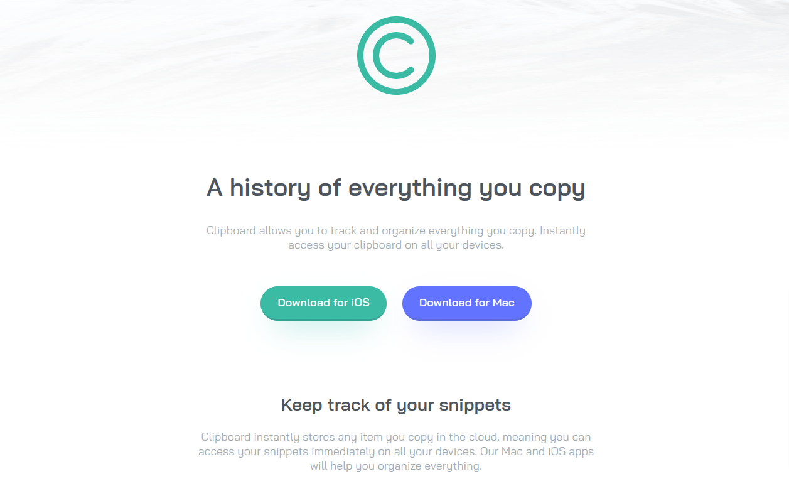

# Frontend Mentor - Clipboard landing page solution

This is a solution to the [Clipboard landing page challenge on Frontend Mentor](https://www.frontendmentor.io/challenges/clipboard-landing-page-5cc9bccd6c4c91111378ecb9). Frontend Mentor challenges help you improve your coding skills by building realistic projects. 

## Table of contents

- [Overview](#overview)
  - [The challenge](#the-challenge)
  - [Screenshot](#screenshot)
  - [Links](#links)
- [My process](#my-process)
  - [Built with](#built-with)
- [Author](#author)
- [Acknowledgments](#acknowledgments)

**Note: Delete this note and update the table of contents based on what sections you keep.**

## Overview

### The challenge

Users should be able to:

- View the optimal layout for the site depending on their device's screen size
- See hover states for all interactive elements on the page

### Screenshot




### Links

- Solution URL: [Add solution URL here](https://xulab5.github.io/clipboard-landing-page-master/)
- Live Site URL: [Add live site URL here](https://www.frontendmentor.io/solutions/clipboardlandingpagemaster-fBjN2d0OKp)

## My process

### Built with

- Semantic HTML5 markup
- CSS custom properties
- Flexbox
- CSS Grid
- Mobile-first workflow


**Note: These are just examples. Delete this note and replace the list above with your own choices**

```html
  <body>
  <header id="header">
    <div class="header-container">
      
    </div>
  </header>
<main id="main-home">
  <div class="index">
    <section class="index__welcome">
        <h1 class="index__title">A history of everything you copy</h1>
        <div class="index__text">
          <p> Clipboard allows you to track and organize everything you 
            copy. Instantly access your clipboard on all your devices.
          </p>
        </div>
        <div class="index__ctas">
          <div class="index__cta"> 
            <a href="#" class="cta-btn cta-btn-ios">Download for iOS</a>
          </div>
          <div class="index__cta"> 
            <a href="#" class="cta-btn cta-btn-mac">Download for Mac</a>
          </div>
        </div>
    </section>
    <section class="index__functions">
      <h2 class="index__subtitle">Keep track of your snippets</h2>
      <div class="index__text">
        <p>
          Clipboard instantly stores any item you copy in the cloud, 
          meaning you can access your snippets immediately on all your 
          devices. Our Mac and iOS apps will help you organize everything.
        </p>
      </div>
      <div class="functions">
        <div class="functions__image">
          
        </div>
        <div class="functions-container">
          <ul class="functions-list">
            <li class="function-item">
              <h3 class="function-item__title">Quick Search</h3>
              <p class="function-item__description">
                Easily search your snippets by content, category, web address, application, and more.
             </p>
            </li>
            <li class="function-item">
              <h3 class="function-item__title">iCloud Sync</h3>
              <p class="function-item__description">
                Instantly saves and syncs snippets across all your devices.
              </p>
            </li>
            <li class="function-item">
              <h3 class="function-item__title">Complete History</h3>
              <p class="function-item__description">
                Retrieve any snippets from the first moment you started using the app.
              </p>
            </li>
          </ul>
        </div>
      </div>
    </section>
    <section class="index__access">
      <h2 class="index__subtitle">Access Clipboard anywhere</h2>
      <div class="index__text">
        <p>
          Whether you're on the go, or at your computer, you can access all your Clipboard 
  snippets in a few simple clicks.
        </p>
      </div>
      <div class="access">
        <div class="access__image">
          
        </div>
      </div>
    </section>
    <section class="index__workflow">
      <h2 class="index__subtitle">Supercharge your workflow</h2>
      <div class="index__text">
        <p>
          We've got the tools to boost your productivity.
        </p>
      </div>
      <div class="workflow-container">
        <ul class="workflow-list">
          <li class="worklfow-item">
            <div class="worklfow-item__icon">
              
            </div>
            <h3 class="workflow-item__title">Create blacklists</h3>
            <div class="workflow-item__description">
              <p>Ensure sensitive information never makes its way to your clipboard by excluding certain sources.</p> 
            </div>
          </li>
          <li class="worklfow-item">
            <div class="worklfow-item__icon">
              
            </div>
            <h3 class="workflow-item__title">Plain text snippets</h3>
            <div class="workflow-item__description">
             <p> Remove unwanted formatting from copied text for a consistent look.</p>
            </div>
          </li>
          <li class="worklfow-item">
            <div class="worklfow-item__icon">
              
            </div>
            <h3 class="workflow-item__title">Sneak preview</h3>
            <div class="workflow-item__description">
             <p> Quick preview of all snippets on your Clipboard for easy access.</p>
            </div>
          </li>
        </ul>
      </div>
    </section>
    <section class="index__brands">
      <div class="brands-container">
        <ul class="brands-logo-list">
          <li class="brand-logo">
            
          </li>
          <li class="brand-logo">
            
          </li>
          <li class="brand-logo">
            
          </li>
          <li class="brand-logo">
            
          </li>
          <li class="brand-logo">
            
          </li>
        </ul>
      </div>
    </section>
    <section class="index__clipboard">
      <h2 class="index__subtitle">Clipboard for iOS and Mac OS</h2>
      <div class="index__text">
        <p>
          Available for free on the App Store. Download for Mac or iOS, sync with iCloud 
  and you're ready to start adding to your clipboard.
        </p>
      </div>
      <div class="index__ctas">
        <div class="index__cta"> 
          <a href="#" class="cta-btn cta-btn-ios">Download for iOS</a>
        </div>
        <div class="index__cta"> 
          <a href="#" class="cta-btn cta-btn-mac">Download for Mac</a>
        </div>
      </div>
    </section>
  </div>
</main> 
  
  <footer id="footer">
    <div class="footer-container">
      <div class="footer-column">
        <div class="footer-logo">
          
        </div>
      </div>
      <div class="footer-column">
        <div class="footer-links">
          <ul class="links">
            <li><a href="#" title="Check out FAQ">FAQs</a></li>
            <li><a href="#" title="Send use a message">Contact Us</a></li>
            <li><a href="#" title="Check out our Privacy Policy">Privacy Policy</a></li>
            <li><a href="#" title="Press Kit">Press Kit</a></li>
            <li><a href="#" title="Check our Install Guide">Install Guide</a></li>
          </ul>
        </div>
      </div>
      <div class="footer-column">
        <div class="footer-social social-block">
          <ul class="social-icons">
            <li>
              <a href="#" target="_blank" class="social-facebook" title="Loewer Powersports on Facebook">
                <!--  -->
                <i class="fa fa-facebook-square"></i>
                <span class="sr-only">Like on Facebook! (opens in new window)</span>
              </a>
            </li>
            <li>
              <a href="#" target="_blank" class="social-twitter" title="Loewer Powersports on Facebook">
                <!--  -->
                <i class="fa fa-twitter"></i>
                <span class="sr-only">Like on Facebook! (opens in new window)</span>
              </a>
            </li>
            <li>
              <a href="#" target="_blank" class="social-instagram" aria-describedby="audioeye_new_window_message">
                <!--  -->
                <i class="fa fa-instagram"></i>
                <span class="sr-only">Follow on Instagram! (opens in new window)</span>
              </a>
            </li>
          </ul>
        </div>
      </div>      
    </div>
    <div class="creator">
      <p class="attribution">
        Challenge by <a href="https://www.frontendmentor.io?ref=challenge" target="_blank">Frontend Mentor</a>. 
        Coded by <a href="#">Steven Sub</a>.
      </p>
    </div>
    
  </footer>
</body>
```

## Author

- Website - [Xulab](https://substeven.netlify.app/)
- Frontend Mentor - [@Xulab05](https://www.frontendmentor.io/profile/Xulab5)
- Instagram - [@Xulab05](https://www.instagram.com/xulab05/)

## Acknowledgments
I'd like to give thanks to Front-end for this awesome short project.
